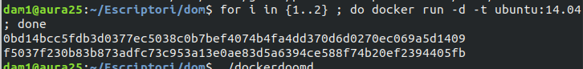
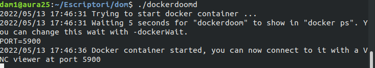
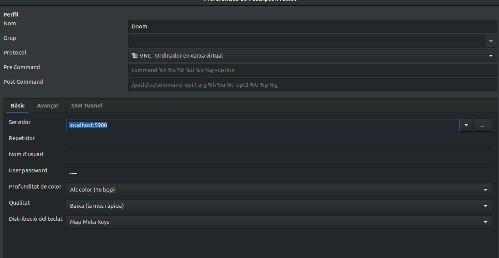
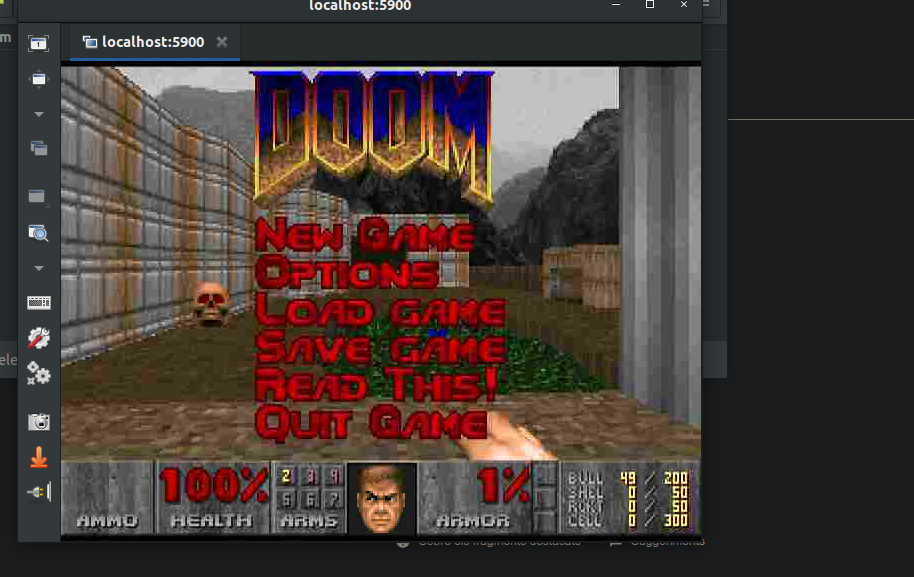

# DoomDocker

Docker doom es un contenedor en docker que permite eliminar otros contenedores de docker en doom

Estos contenedores de doom servirán para tener al menos dos  enemigos en forma de contenedores

Se descomprime y se ejecuta el script de [https://web.archive.org/web/20160310005603/https://www.gideonred.com/bins/dockerdoomd.tar.gz](https://www.google.com/url?q=https://web.archive.org/web/20160310005603/https://www.gideonred.com/bins/dockerdoomd.tar.gz&sa=D&source=editors&ust=1652726157679142&usg=AOvVaw0A_RpXglW30FPQZOKWSML-)

Después se abre un cliente vnc en puerto 5900 y contraseña 1234

Se ejecuta sin problemas
